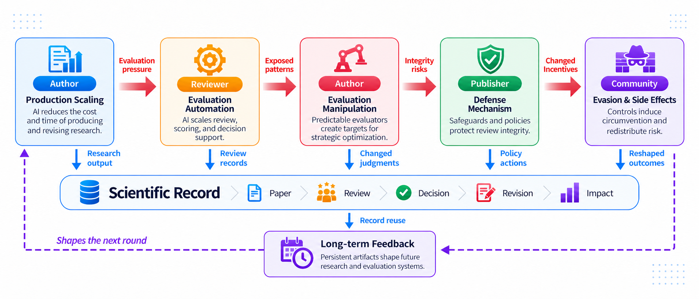

# 📚 Awesome AI Paper–Review Arms Race

[](#citation-and-contact)
[](#news)
[](#news)
[](#contributing)

A reading list accompanying **The Emerging AI Paper-Review Arms Race: Adversarial Co-Evolution in Scholarly Publishing**.

<a id="news"></a>

## 📢 News

- **2026.09 (planned)** — Survey paper release. Paper link and final citation to be added.

<a id="introduction"></a>

## 🔎 Introduction

Generative and agentic AI are reshaping both the production and evaluation of scientific research. These developments are often studied separately, as questions of how AI can produce research and how AI can review it. We argue that this separation misses an increasingly important feature of scholarly publishing: changes on one side alter the incentives, constraints, and behavior of the other. We synthesize 230 scholarly publications and institutional records using a taxonomy of six connected dynamics: production scaling, evaluation automation, evaluation manipulation, defense mechanisms and policy responses, evasion and side effects, and long-horizon ecosystem feedback.

The literature shows an emerging progression in which cheaper and faster research production increases pressure on evaluation, AI-mediated evaluation becomes more scalable and repeatable, participants can exploit evaluator regularities, and institutions respond with technical safeguards and policy controls. These responses can in turn induce evasion, redistribute errors and workload, and shape the scholarly records reused by future research and evaluation systems.

Evidence is strongest for production and evaluation at scale, reproducible manipulation, and institutional response, while post-policy adaptation and artifact-level long-horizon feedback remain less directly observed. This systems view shifts attention from isolated AI capabilities toward how scholarly actors and AI systems adapt to one another over time.

[](assets/overview.png)

<a id="table-of-contents"></a>

## 🧭 Table of Contents

- [📢 News](#news)
- [🔎 Introduction](#introduction)
- [📖 Reading List](#reading-list)
  - [✍️ Part 1: Scaling Scholarly Production](#production)
  - [🔍 Part 2: Automating Scholarly Evaluation](#evaluation)
  - [🎯 Part 3: Evaluation Manipulation](#manipulation)
  - [🛡️ Part 4: Defense Mechanisms and Policy Responses](#defense)
  - [🔀 Part 5: Evasion and Side Effects](#evasion)
  - [🔄 Part 6: Long-Horizon Ecosystem Feedback](#feedback)
  - [📚 Part 7: Related Surveys and Background](#background)
  - [🏛️ Part 8: Institutional Records](#institutional-records)
- [📝 Citation & Contact](#citation-and-contact)
- [🤝 Contributing](#contributing)

<a id="reading-list"></a>

## 📖 Reading List

Expand a category to browse its papers. Titles link directly to paper pages. Entries follow the manuscript's taxonomy and are sorted newest first within each category. Year and venue labels follow the bibliography; linked pages may host newer versions.

<a id="production"></a>

<details>
<summary><strong>✍️ Part 1: Scaling Scholarly Production</strong><br><sub>AI-assisted writing, research agents, faster output, and scalable revision.</sub></summary>

<!-- bib:ghareeb2026multi -->
- **[A multi-agent system for automating scientific discovery](https://doi.org/10.1038/s41586-026-10652-y)**  
  `2026` · Nature · Ghareeb et al.

<!-- bib:wagstaff2026aaai -->
- **[AAAI-26 Dual Submissions: Novel Challenges](https://arxiv.org/abs/2607.11918)**  
  `2026` · arXiv · Wagstaff et al.

<!-- bib:tang2026ai -->
- **[AI-researcher: Autonomous scientific innovation](https://doi.org/10.52202/085713-0320)**  
  `2026` · NeurIPS · Tang et al.

<!-- bib:zhao2026apres -->
- **[APRES: An Agentic Paper Revision and Evaluation System](https://arxiv.org/abs/2603.03142)**  
  `2026` · arXiv · Zhao et al.

<!-- bib:ruan2026author -->
- **[Author-in-the-Loop Response Generation and Evaluation: Integrating Author Expertise and Intent in Responses to Peer Review](https://doi.org/10.18653/v1/2026.acl-long.565)**  
  `2026` · ACL · Ruan et al.

<!-- bib:liu2026autoresearchclaw -->
- **[Autoresearchclaw: Self-reinforcing autonomous research with human-AI collaboration](https://arxiv.org/abs/2605.20025)**  
  `2026` · arXiv · Liu et al.

<!-- bib:kirgis2026can -->
- **[Can AI agents conduct open-ended AI research? Early evidence from two case studies](https://arxiv.org/abs/2607.27191)**  
  `2026` · arXiv · Kirgis et al.

<!-- bib:luo2026can -->
- **[Can AI Revise Research Papers with Human Review Feedback? An Empirical Study and Benchmark](https://doi.org/10.18653/v1/2026.findings-acl.887)**  
  `2026` · ACL Findings · Luo et al.

<!-- bib:wu2026claw -->
- **[Claw AI Lab: An Autonomous Multi-Agent Research Team](https://arxiv.org/abs/2605.22662)**  
  `2026` · arXiv · Wu et al.

<!-- bib:renault2026comment -->
- **[Comment on Scientific production in the era of large language models](https://arxiv.org/abs/2605.17979)**  
  `2026` · arXiv · Renault et al.

<!-- bib:maupin2025dramatic -->
- **[Dramatic increases in redundant publications in the Generative AI era](https://doi.org/10.1186/s12916-025-04569-y)**  
  `2026` · BMC Medicine · Maupin et al.

<!-- bib:han2026drpg -->
- **[DRPG (Decompose, Retrieve, Plan, Generate): An Agentic Framework for Academic Rebuttal](https://doi.org/10.18653/v1/2026.findings-acl.2051)**  
  `2026` · ACL Findings · Han et al.

<!-- bib:lyu2026evoscientist -->
- **[Evoscientist: Towards multi-agent evolving AI scientists for end-to-end scientific discovery](https://arxiv.org/abs/2603.08127)**  
  `2026` · arXiv · Lyu et al.

<!-- bib:tang2026fars -->
- **[FARS: A Fully Automated Research System Deployed at Scale](https://arxiv.org/abs/2606.31651)**  
  `2026` · arXiv · Tang et al.

<!-- bib:knight2026flooded -->
- **[Flooded Gateways](https://doi.org/10.2139/ssrn.6297213)**  
  `2026` · SSRN · Knight

<!-- bib:gartenberg2026more -->
- **[More versus better: Artificial intelligence, incentives, and the emerging crisis in peer review](https://doi.org/10.1287/orsc.2026.ed.v37.n3)**  
  `2026` · Organization Science · Gartenberg et al.

<!-- bib:ma2026paper2rebuttal -->
- **[Paper2rebuttal: A multi-agent framework for transparent author response assistance](https://doi.org/10.18653/v1/2026.acl-long.2140)**  
  `2026` · ACL · Ma et al.

<!-- bib:ye2026paperclaw -->
- **[PaperClaw: Harnessing Agents for Autonomous Research and Human-in-the-Loop Refinement](https://arxiv.org/abs/2606.22610)**  
  `2026` · arXiv · Ye et al.

<!-- bib:song2026paperorchestra -->
- **[Paperorchestra: A multi-agent framework for automated AI research paper writing](https://arxiv.org/abs/2604.05018)**  
  `2026` · arXiv · Song et al.

<!-- bib:yuan2026paperorchestrator -->
- **[PaperOrchestrator: An LLM-Orchestrated multi-agent pipeline for automated end-to-end scientific paper writing](https://doi.org/10.1007/s44443-026-00708-4)**  
  `2026` · Journal of King Saud University Computer and Information Sciences · Yuan et al.

<!-- bib:kamran2026prompt -->
- **[Prompt-to-Paper: Agentic AI System for Bioinformatics](https://arxiv.org/abs/2607.05456)**  
  `2026` · arXiv · Kamran et al.

<!-- bib:wu2026towards -->
- **[Towards a medical AI scientist](https://arxiv.org/abs/2603.28589)**  
  `2026` · arXiv · Wu et al.

<!-- bib:chen2026xtragpt -->
- **[Xtragpt: Context-aware and controllable academic paper revision via human-AI collaboration](https://doi.org/10.18653/v1/2026.acl-long.47)**  
  `2026` · ACL · Chen et al.

<!-- bib:schmidgall2025agent -->
- **[Agent laboratory: Using LLM agents as research assistants](https://doi.org/10.18653/v1/2025.findings-emnlp.320)**  
  `2025` · EMNLP Findings · Schmidgall et al.

<!-- bib:schmidgall2025agentrxiv -->
- **[Agentrxiv: Towards collaborative autonomous research](https://arxiv.org/abs/2503.18102)**  
  `2025` · arXiv · Schmidgall et al.

<!-- bib:ifargan2025autonomous -->
- **[Autonomous LLM-driven research—from data to human-verifiable research papers](https://doi.org/10.1056/aioa2400555)**  
  `2025` · NEJM AI · Ifargan et al.

<!-- bib:filimonovic2025can -->
- **[Can GenAI improve academic performance? Evidence from the social and behavioral sciences](https://arxiv.org/abs/2510.02408)**  
  `2025` · arXiv · Filimonovic et al.

<!-- bib:jansen2025codescientist -->
- **[Codescientist: End-to-end semi-automated scientific discovery with code-based experimentation](https://doi.org/10.18653/v1/2025.findings-acl.692)**  
  `2025` · ACL Findings · Jansen et al.

<!-- bib:weng2025cycleresearcher -->
- **[Cycleresearcher: Improving automated research via automated review](https://arxiv.org/abs/2411.00816)**  
  `2025` · ICLR · Weng et al.

<!-- bib:kobak2025delving -->
- **[Delving into LLM-assisted writing in biomedical publications through excess vocabulary](https://doi.org/10.1126/sciadv.adt3813)**  
  `2025` · Science Advances · Kobak et al.

<!-- bib:qi2025does -->
- **[Does GenAI Rewrite How We Write? An Empirical Study on Two-Million Preprints](https://arxiv.org/abs/2510.17882)**  
  `2025` · arXiv · Qi et al.

<!-- bib:miyai2025jr -->
- **[Jr. AI scientist and its risk report: Autonomous scientific exploration from a baseline paper](https://arxiv.org/abs/2511.04583)**  
  `2025` · arXiv · Miyai et al.

<!-- bib:liang2025quantifying -->
- **[Quantifying large language model usage in scientific papers](https://doi.org/10.1038/s41562-025-02273-8)**  
  `2025` · Nature Human Behaviour · Liang et al.

<!-- bib:baek2025researchagent -->
- **[Researchagent: Iterative research idea generation over scientific literature with large language models](https://doi.org/10.18653/v1/2025.naacl-long.342)**  
  `2025` · NAACL · Baek et al.

<!-- bib:kusumegi2025scientific -->
- **[Scientific production in the era of large language models](https://doi.org/10.1126/science.adw3000)**  
  `2025` · Science · Kusumegi et al.

<!-- bib:li2025self -->
- **[Self-reflection enhances large language models towards substantial academic response](https://doi.org/10.1038/s44387-025-00045-3)**  
  `2025` · npj Artificial Intelligence · Li et al.

<!-- bib:yamada2025ai -->
- **[The AI scientist-v2: Workshop-level automated scientific discovery via agentic tree search](https://arxiv.org/abs/2504.08066)**  
  `2025` · arXiv · Yamada et al.

<!-- bib:gottweis2025towards -->
- **[Towards an AI co-scientist](https://arxiv.org/abs/2502.18864)**  
  `2025` · arXiv · Gottweis et al.

<!-- bib:porter2024identifying -->
- **[Identifying fabricated networks within authorship-for-sale enterprises](https://doi.org/10.1038/s41598-024-71230-8)**  
  `2024` · Scientific Reports · Porter et al.

<!-- bib:lu2024ai -->
- **[The AI scientist: Towards fully automated open-ended scientific discovery](https://arxiv.org/abs/2408.06292)**  
  `2024` · arXiv · Lu et al.

<!-- bib:abalkina2023publication -->
- **[Publication and collaboration anomalies in academic papers originating from a paper mill: Evidence from a Russia-based paper mill](https://doi.org/10.1002/leap.1574)**  
  `2023` · Learned Publishing · Abalkina

[↑ Table of Contents](#table-of-contents)

</details>


<a id="evaluation"></a>

<details>
<summary><strong>🔍 Part 2: Automating Scholarly Evaluation</strong><br><sub>Review generation, reviewer assistance, scientific verification, and evaluation reliability.</sub></summary>

<!-- bib:thakkar2026large -->
- **[A large-scale randomized study of large language model feedback in peer review](https://doi.org/10.1038/s42256-026-01188-x)**  
  `2026` · Nature Machine Intelligence · Thakkar et al.

<!-- bib:biswas2026ai -->
- **[AI-assisted peer review at scale: The AAAI-26 AI review pilot](https://arxiv.org/abs/2604.13940)**  
  `2026` · arXiv · Biswas et al.

<!-- bib:dycke2026automatic -->
- **[Automatic reviewers fail to detect faulty reasoning in research papers: A new counterfactual evaluation framework](https://doi.org/10.1162/tacl.a.642)**  
  `2026` · TACL · Dycke et al.

<!-- bib:afzal2026beyond -->
- **[Beyond" not novel enough": Enriching scholarly critique with LLM-assisted feedback](https://doi.org/10.18653/v1/2026.eacl-long.121)**  
  `2026` · EACL · Afzal et al.

<!-- bib:wu2026drafting -->
- **[Can AI Review Improve Paper Drafting? An Empirical Study on 20 Computer Architecture Submissions](https://arxiv.org/abs/2606.01013)**  
  `2026` · arXiv · Wu

<!-- bib:weng2026deepreviewer -->
- **[Deepreviewer 2.0: A traceable agentic system for auditable scientific peer review](https://arxiv.org/abs/2604.09590)**  
  `2026` · arXiv · Weng et al.

<!-- bib:sharma2026llms -->
- **[Do LLMs Favor LLMs? Quantifying Interaction Effects in Peer Review](https://doi.org/10.1145/3805689.3806505)**  
  `2026` · FAccT · Sharma et al.

<!-- bib:ballakuraya2026methods -->
- **[Do Methods Support the Claims? Intra-Paper Verification for Peer Review](https://arxiv.org/abs/2607.26066)**  
  `2026` · arXiv · Ballakuraya et al.

<!-- bib:qiu2026egtr -->
- **[EGTR-Review: Efficient Evidence-Grounded Scientific Peer Review Generation via Multi-Agent Teacher Distillation](https://arxiv.org/abs/2606.06025)**  
  `2026` · arXiv · Qiu et al.

<!-- bib:li2026evaluating -->
- **[Evaluating the Impact of Reviewer Guideline Design on LLM-Based Automated Peer Review](https://doi.org/10.18653/v1/2026.findings-acl.1511)**  
  `2026` · ACL Findings · Li et al.

<!-- bib:fang2026passive -->
- **[From Passive Generation to Investigation: A Proactive Scientific Peer Review Agent](https://arxiv.org/abs/2606.13349)**  
  `2026` · arXiv · Fang et al.

<!-- bib:wang2026human -->
- **[Human–AI Collaboration in Science at Scale: A Large-Scale Randomized Field Experiment](https://doi.org/10.5465/amproc.2026.21478abstract)**  
  `2026` · Academy of Management Proceedings · Wang et al.

<!-- bib:gaddipati2026mlreplicate -->
- **[MLReplicate: Benchmarking Autonomous Research Systems for Machine Learning Reproducibility](https://arxiv.org/abs/2605.16616)**  
  `2026` · arXiv · Gaddipati et al.

<!-- bib:kim2026limits -->
- **[On the limits and opportunities of AI reviewers: Reviewing the reviews of Nature-family papers with 45 expert scientists](https://arxiv.org/abs/2605.20668)**  
  `2026` · arXiv · Kim et al.

<!-- bib:chen2026peercheck -->
- **[PeerCheck: Enhancing LLM-Generated Academic Reviews Towards Human-Level Quality](https://doi.org/10.18653/v1/2026.findings-acl.1170)**  
  `2026` · ACL Findings · Chen et al.

<!-- bib:ghorbanpour2026peerispect -->
- **[Peerispect: Claim Verification in Scientific Peer Reviews](https://arxiv.org/abs/2604.17667)**  
  `2026` · arXiv · Ghorbanpour et al.

<!-- bib:loc2026prism -->
- **[PRISM: A Multi-Dimensional Benchmark for Evaluating LLM Peer Reviewers](https://arxiv.org/abs/2605.26730)**  
  `2026` · arXiv · Loc et al.

<!-- bib:li2026reviewgrounder -->
- **[ReviewGrounder: Improving Review Substantiveness with Rubric-Guided, Tool-Integrated Agents](https://doi.org/10.18653/v1/2026.acl-long.1477)**  
  `2026` · ACL · Li et al.

<!-- bib:goyal2026scholarpeer -->
- **[ScholarPeer: A context-aware multi-agent framework for automated peer review](https://arxiv.org/abs/2601.22638)**  
  `2026` · arXiv · Goyal et al.

<!-- bib:ou2025claimcheck -->
- **[CLAIMCHECK: How Grounded are LLM Critiques of Scientific Papers?](https://doi.org/10.18653/v1/2025.findings-emnlp.1185)**  
  `2025` · EMNLP Findings · Ou et al.

<!-- bib:zhu2025deepreview -->
- **[Deepreview: Improving LLM-based paper review with human-like deep thinking process](https://doi.org/10.18653/v1/2025.acl-long.1420)**  
  `2025` · ACL · Zhu et al.

<!-- bib:bougie2025generative -->
- **[Generative reviewer agents: Scalable simulacra of peer review](https://doi.org/10.18653/v1/2025.emnlp-industry.8)**  
  `2025` · EMNLP Industry · Bougie et al.

<!-- bib:hossain2025llms -->
- **[LLMs as meta-reviewers’ assistants: A case study](https://doi.org/10.18653/v1/2025.naacl-long.395)**  
  `2025` · NAACL · Hossain et al.

<!-- bib:idahl2025openreviewer -->
- **[OpenReviewer: A specialized large language model for generating critical scientific paper reviews](https://doi.org/10.18653/v1/2025.naacl-demo.44)**  
  `2025` · NAACL System Demonstrations · Idahl et al.

<!-- bib:gao2025reviewagents -->
- **[Reviewagents: Bridging the gap between human and AI-generated paper reviews](https://arxiv.org/abs/2503.08506)**  
  `2025` · arXiv · Gao et al.

<!-- bib:garg2025revieweval -->
- **[ReviewEval: An Evaluation Framework for AI-Generated Reviews.](https://doi.org/10.18653/v1/2025.findings-emnlp.1120)**  
  `2025` · EMNLP Findings · Garg et al.

<!-- bib:zeng2025reviewrl -->
- **[Reviewrl: towards automated scientific review with RL](https://doi.org/10.18653/v1/2025.emnlp-main.857)**  
  `2025` · EMNLP · Zeng et al.

<!-- bib:russo2025ai -->
- **[The AI review lottery: Widespread AI-assisted peer reviews boost paper scores and acceptance rates](https://arxiv.org/abs/2405.02150)**  
  `2025` · PACM HCI · Russo Latona et al.

<!-- bib:chang2025treereview -->
- **[TreeReview: A dynamic tree of questions framework for deep and efficient LLM-based scientific peer review](https://doi.org/10.18653/v1/2025.emnlp-main.790)**  
  `2025` · EMNLP · Chang et al.

<!-- bib:son2025ai -->
- **[When AI co-scientists fail: Spot-a benchmark for automated verification of scientific research](https://arxiv.org/abs/2505.11855)**  
  `2025` · arXiv · Son et al.

<!-- bib:li2024sentiment -->
- **[A sentiment consolidation framework for meta-review generation](https://doi.org/10.18653/v1/2024.acl-long.547)**  
  `2024` · ACL · Li et al.

<!-- bib:chamoun2024automated -->
- **[Automated focused feedback generation for scientific writing assistance](https://doi.org/10.18653/v1/2024.findings-acl.580)**  
  `2024` · ACL Findings · Chamoun et al.

<!-- bib:yu2024automated -->
- **[Automated peer reviewing in paper sea: Standardization, evaluation, and analysis](https://doi.org/10.18653/v1/2024.findings-emnlp.595)**  
  `2024` · EMNLP Findings · Yu et al.

<!-- bib:liang2024can -->
- **[Can large language models provide useful feedback on research papers? A large-scale empirical analysis](https://doi.org/10.1056/aioa2400196)**  
  `2024` · NEJM AI · Liang et al.

<!-- bib:zhou2024llm -->
- **[Is LLM a reliable reviewer? A comprehensive evaluation of LLM on automatic paper reviewing tasks](https://doi.org/10.63317/48d359hjdvog)**  
  `2024` · LREC-COLING · Zhou et al.

<!-- bib:du2024llms -->
- **[LLMs assist NLP researchers: Critique paper (meta-) reviewing](https://doi.org/10.18653/v1/2024.emnlp-main.292)**  
  `2024` · EMNLP · Du et al.

<!-- bib:d2024marg -->
- **[Marg: Multi-agent review generation for scientific papers](https://arxiv.org/abs/2401.04259)**  
  `2024` · arXiv · D'Arcy et al.

<!-- bib:liang2024monitoring -->
- **[Monitoring AI-modified content at scale: A case study on the impact of ChatGPT on AI conference peer reviews](https://arxiv.org/abs/2403.07183)**  
  `2024` · arXiv · Liang et al.

<!-- bib:goldberg2024usefulness -->
- **[Usefulness of LLMs as an Author Checklist Assistant for Scientific Papers: NeurIPS'24 Experiment](https://arxiv.org/abs/2411.03417)**  
  `2024` · arXiv · Goldberg et al.

<!-- bib:li2023summarizing -->
- **[Summarizing multiple documents with conversational structure for meta-review generation](https://doi.org/10.18653/v1/2023.findings-emnlp.472)**  
  `2023` · EMNLP Findings · Li et al.

<!-- bib:shen2022mred -->
- **[MReD: A meta-review dataset for structure-controllable text generation](https://doi.org/10.18653/v1/2022.findings-acl.198)**  
  `2022` · ACL Findings · Shen et al.

<!-- bib:kang2018dataset -->
- **[A dataset of peer reviews (PeerRead): Collection, insights and NLP applications](https://doi.org/10.18653/v1/n18-1149)**  
  `2018` · NAACL · Kang et al.

[↑ Table of Contents](#table-of-contents)

</details>


<a id="manipulation"></a>

<details>
<summary><strong>🎯 Part 3: Evaluation Manipulation</strong><br><sub>Concealed instructions, presentation changes, multimodal attacks, and adaptive evaluator optimization.</sub></summary>

<!-- bib:jiang2026badscientist -->
- **[BadScientist: Can a Research Agent Write Convincing but Unsound Papers that Fool LLM Reviewers?](https://doi.org/10.18653/v1/2026.acl-long.1134)**  
  `2026` · ACL · Jiang et al.

<!-- bib:zhao2026does -->
- **[Does AI Reviewer See the Full Picture? Attacking and Defending Multimodal Peer Review](https://arxiv.org/abs/2606.12716)**  
  `2026` · arXiv · Zhao et al.

<!-- bib:torrielli2026exploiting -->
- **[Exploiting large language models in peer review: indirect prompt injection attacks and integrity probes](https://doi.org/10.1007/s11192-026-05695-x)**  
  `2026` · Scientometrics · Torrielli et al.

<!-- bib:li2026gaming -->
- **[Gaming AI-Assisted Peer Reviews Poses New Risks to the Scientific Community](https://arxiv.org/abs/2606.10159)**  
  `2026` · arXiv · Li et al.

<!-- bib:lin2026hidden -->
- **[Hidden prompts in manuscripts exploit AI-assisted peer review](https://doi.org/10.31234/osf.io/nea5u_v3)**  
  `2026` · Communications of the ACM · Lin

<!-- bib:choi2026invisible -->
- **[Invisible text injection and peer review by AI models](https://doi.org/10.1001/jamanetworkopen.2025.52099)**  
  `2026` · JAMA Network Open · Choi et al.

<!-- bib:li2026llm -->
- **[LLM-as-a-Reviewer: Benchmarking Their Ability, Divergence, and Prompt Injection Resistance as Paper Reviewers](https://arxiv.org/abs/2605.25415)**  
  `2026` · arXiv · Li et al.

<!-- bib:collu2026misleading -->
- **[Misleading large language models used (or misused) in scientific peer-reviewing via hidden prompt-injection attacks](https://doi.org/10.1145/3803804)**  
  `2026` · ACM Transactions on AI Security and Privacy · Collu et al.

<!-- bib:yang2026no -->
- **[No Hidden Prompts Needed! You Can Game AI Peer Review with Presentation-Only Revisions](https://arxiv.org/abs/2606.13044)**  
  `2026` · arXiv · Yang et al.

<!-- bib:kaneko2026paraphrasing -->
- **[Paraphrasing adversarial attack on LLM-as-a-reviewer](https://arxiv.org/abs/2601.06884)**  
  `2026` · arXiv · Kaneko

<!-- bib:alazraki2026reverse -->
- **[Reverse Engineering Human Preferences with Reinforcement Learning](https://doi.org/10.52202/085713-3388)**  
  `2026` · NeurIPS · Alazraki et al.

<!-- bib:hatzel2026review -->
- **[Review Arcade: On the Human Alignment and Gameability of LLM Reviews](https://arxiv.org/abs/2605.28897)**  
  `2026` · arXiv · Hatzel et al.

<!-- bib:ding2026rubrics -->
- **[Rubrics as an attack surface: Stealthy preference drift in LLM judges](https://arxiv.org/abs/2602.13576)**  
  `2026` · arXiv · Ding et al.

<!-- bib:baumann2026stop -->
- **[Stop automating peer review without rigorous evaluation](https://arxiv.org/abs/2605.03202)**  
  `2026` · arXiv · Baumann et al.

<!-- bib:yang2026turning -->
- **[Turning Bias into Bugs: Bandit-Guided Style Manipulation Attacks on LLM Judges](https://arxiv.org/abs/2605.26156)**  
  `2026` · arXiv · Yang et al.

<!-- bib:wang2026ai -->
- **[When AI reviews science: Can we trust the referee?](https://arxiv.org/abs/2604.23593)**  
  `2026` · arXiv · Wang et al.

<!-- bib:zhou2025give -->
- **[" Give a Positive Review Only": An Early Investigation Into In-Paper Prompt Injection Attacks and Defenses for AI Reviewers](https://arxiv.org/abs/2511.01287)**  
  `2025` · arXiv · Zhou et al.

<!-- bib:lin2025breaking -->
- **[Breaking the Reviewer: Assessing the Vulnerability of Large Language Models in Automated Peer Review Under Textual Adversarial Attacks.](https://doi.org/10.18653/v1/2025.findings-emnlp.259)**  
  `2025` · EMNLP Findings · Lin et al.

<!-- bib:xiong2025invisible -->
- **[Invisible prompts, visible threats: Malicious font injection in external resources for large language models](https://arxiv.org/abs/2505.16957)**  
  `2025` · arXiv · Xiong et al.

<!-- bib:li2025llm -->
- **[LLM-REVal: Can We Trust LLM Reviewers Yet?](https://arxiv.org/abs/2510.12367)**  
  `2025` · arXiv · Li et al.

<!-- bib:theocharopoulos2025multilingual -->
- **[Multilingual Hidden Prompt Injection Attacks on LLM-Based Academic Reviewing](https://arxiv.org/abs/2512.23684)**  
  `2025` · arXiv · Theocharopoulos et al.

<!-- bib:sahoo2025reject -->
- **[When Reject Turns into Accept: Quantifying the Vulnerability of LLM-Based Scientific Reviewers to Indirect Prompt Injection](https://arxiv.org/abs/2512.10449)**  
  `2025` · arXiv · Sahoo et al.

<!-- bib:zhu2025your -->
- **[When your reviewer is an LLM: Biases, divergence, and prompt injection risks in peer review](https://arxiv.org/abs/2509.09912)**  
  `2025` · arXiv · Zhu et al.

<!-- bib:li2025llms -->
- **[Where do LLMs go wrong? diagnosing automated peer review via aspect-guided multi-level perturbation](https://doi.org/10.1145/3746252.3761274)**  
  `2025` · CIKM · Li et al.

<!-- bib:ye2024we -->
- **[Are we there yet? revealing the risks of utilizing large language models in scholarly peer review](https://arxiv.org/abs/2412.01708)**  
  `2024` · arXiv · Ye et al.

<!-- bib:raina2024llm -->
- **[Is LLM-as-a-judge robust? investigating universal adversarial attacks on zero-shot LLM assessment](https://doi.org/10.18653/v1/2024.emnlp-main.427)**  
  `2024` · EMNLP · Raina et al.

<!-- bib:wang2024large -->
- **[Large language models are not fair evaluators](https://doi.org/10.18653/v1/2024.acl-long.511)**  
  `2024` · ACL · Wang et al.

<!-- bib:shi2024optimization -->
- **[Optimization-based prompt injection attack to LLM-as-a-judge](https://doi.org/10.1145/3658644.3690291)**  
  `2024` · CCS · Shi et al.

<!-- bib:stelmakh2023cite -->
- **[Cite-seeing and reviewing: A study on citation bias in peer review](https://doi.org/10.1371/journal.pone.0283980)**  
  `2023` · PLOS ONE · Stelmakh et al.

[↑ Table of Contents](#table-of-contents)

</details>


<a id="defense"></a>

<details>
<summary><strong>🛡️ Part 4: Defense Mechanisms and Policy Responses</strong><br><sub>Detection, artifact verification, evaluator safeguards, and institutional responses.</sub></summary>

<!-- bib:he2026academic -->
- **[Academic journals’ AI policies fail to curb the surge in AI-assisted academic writing](https://doi.org/10.1073/pnas.2526734123)**  
  `2026` · PNAS · He et al.

<!-- bib:ohta2026ai -->
- **[AI-assisted pre-review of open-source software submissions: an experience report from BOSC 2026](https://arxiv.org/abs/2607.27228)**  
  `2026` · arXiv · Ohta et al.

<!-- bib:armitage2026artificial -->
- **[Artificial intelligence policies in disaster research: a review of journals and their publishers](https://doi.org/10.1016/j.ijdrr.2026.106078)**  
  `2026` · International Journal of Disaster Risk Reduction · Armitage

<!-- bib:saha2026policies -->
- **[Policies Permitting LLM Use for Polishing Peer Reviews Are Currently Not Enforceable](https://arxiv.org/abs/2603.20450)**  
  `2026` · arXiv · Saha et al.

<!-- bib:wang2026policy -->
- **[Policy snapshots cannot establish journal AI-policy failure](https://doi.org/10.1073/pnas.2616276123)**  
  `2026` · PNAS · Wang

<!-- bib:you2026preventing -->
- **[Preventing the Collapse of Peer Review Requires Verification-First AI](https://arxiv.org/abs/2601.16909)**  
  `2026` · arXiv · You et al.

<!-- bib:fettiplace2026recommendations -->
- **[Recommendations for disclosure of artificial intelligence in scientific writing and publishing: a regional anesthesia and pain medicine modified Delphi study](https://doi.org/10.1136/rapm-2025-106852)**  
  `2026` · Regional Anesthesia & Pain Medicine · Fettiplace et al.

<!-- bib:he2026reply -->
- **[Reply to Wang: Policy failure can be assessed from observed outcomes](https://doi.org/10.1073/pnas.2617762123)**  
  `2026` · PNAS · He et al.

<!-- bib:xin2026safereview -->
- **[SafeReview: Defending LLM-based Review Systems Against Adversarial Hidden Prompts](https://arxiv.org/abs/2604.26506)**  
  `2026` · arXiv · Xin et al.

<!-- bib:hu2026scifigdetect -->
- **[SciFigDetect: A Benchmark for AI-Generated Scientific Figure Detection](https://arxiv.org/abs/2604.08211)**  
  `2026` · arXiv · Hu et al.

<!-- bib:duarte2026sem -->
- **[Sem-Detect: Semantic Level Detection of AI Generated Peer-Reviews](https://arxiv.org/abs/2605.21713)**  
  `2026` · arXiv · Duarte et al.

<!-- bib:ma2026shattering -->
- **[Shattering the Echo Chamber: Hidden Safeguards in Manuscripts Against the AI Takeover of Peer Review](https://arxiv.org/abs/2605.05271)**  
  `2026` · arXiv · Ma et al.

<!-- bib:huang2026tab -->
- **[TAB-AUDIT: Detecting AI-Fabricated Scientific Tables via Multi-View Likelihood Mismatch](https://arxiv.org/abs/2603.19712)**  
  `2026` · arXiv · Huang et al.

<!-- bib:jayaram2026towards -->
- **[Towards Automating Scientific Review with Google's Paper Assistant Tool](https://arxiv.org/abs/2606.28277)**  
  `2026` · arXiv · Jayaram et al.

<!-- bib:chen2026happens -->
- **[What happens when reviewers receive AI feedback in their reviews?](https://doi.org/10.1145/3772318.3791431)**  
  `2026` · CHI · Chen et al.

<!-- bib:cleland2026and -->
- **[When and how to disclose AI use in academic publishing: AMEE Guide No. 192](https://doi.org/10.1080/0142159x.2025.2607513)**  
  `2026` · Medical Teacher · Cleland et al.

<!-- bib:rao2025detecting -->
- **[Detecting LLM-generated peer reviews](https://doi.org/10.1371/journal.pone.0331871)**  
  `2025` · PLOS ONE · Rao et al.

<!-- bib:cao2025dissecting -->
- **[Dissecting submission limit in desk-rejections: A mathematical analysis of fairness in AI conference policies](https://arxiv.org/abs/2502.00690)**  
  `2025` · arXiv · Cao et al.

<!-- bib:nemecek2025feasibility -->
- **[The feasibility of topic-based watermarking on academic peer reviews](https://doi.org/10.18653/v1/2025.findings-ijcnlp.36)**  
  `2025` · IJCNLP–AACL · Nemecek et al.

<!-- bib:luo2025more -->
- **[The more you automate, the less you see: Hidden pitfalls of AI scientist systems](https://arxiv.org/abs/2509.08713)**  
  `2025` · arXiv · Luo et al.

<!-- bib:yu2024your -->
- **[Is your paper being reviewed by an LLM? investigating AI text detectability in peer review](https://arxiv.org/abs/2410.03019)**  
  `2024` · arXiv · Yu et al.

<!-- bib:ganjavi2024publishers -->
- **[Publishers’ and journals’ instructions to authors on use of generative artificial intelligence in academic and scientific publishing: bibliometric analysis](https://doi.org/10.1136/bmj-2023-077192)**  
  `2024` · BMJ · Ganjavi et al.

<!-- bib:hadan2024great -->
- **[The great AI witch hunt: Reviewers’ perception and (Mis) conception of generative AI in research writing](https://doi.org/10.1016/j.chbah.2024.100095)**  
  `2024` · Computers in Human Behavior: Artificial Humans · Hadan et al.

<!-- bib:li2024use -->
- **[Use of artificial intelligence in peer review among top 100 medical journals](https://doi.org/10.1001/jamanetworkopen.2024.48609)**  
  `2024` · JAMA Network Open · Li et al.

[↑ Table of Contents](#table-of-contents)

</details>


<a id="evasion"></a>

<details>
<summary><strong>🔀 Part 5: Evasion and Side Effects</strong><br><sub>Adaptation to controls and the redistribution of errors, workload, and risk.</sub></summary>

<!-- bib:chen2026coconuts -->
- **[CoCoNUTS: Concentrating on Content while Neglecting Uninformative Textual Styles for AI-Generated Peer Review Detection](https://doi.org/10.18653/v1/2026.acl-long.1240)**  
  `2026` · ACL · Chen et al.

<!-- bib:wang2026detector -->
- **[Detector-Evasive LLM Paraphrasing via Constrained Policy Optimization](https://arxiv.org/abs/2606.00392)**  
  `2026` · arXiv · Wang et al.

<!-- bib:vasu2026justice -->
- **[Justice in judgment: Unveiling (hidden) bias in LLM-assisted peer reviews](https://doi.org/10.18653/v1/2026.findings-acl.14)**  
  `2026` · ACL Findings · Vasu et al.

<!-- bib:gu2026mash -->
- **[MASH: Evading Black-Box AI-Generated Text Detectors via Style Humanization](https://doi.org/10.18653/v1/2026.findings-acl.1487)**  
  `2026` · ACL Findings · Gu et al.

<!-- bib:ali2026stigmatization -->
- **[Stigmatization of AI-assisted research in nursing academia: Moral judgments and epistemic anxiety among nurse academics](https://doi.org/10.1016/j.nedt.2026.107219)**  
  `2026` · Nurse Education Today · Ali et al.

<!-- bib:dilber2026impact -->
- **[The Impact of Language Translation on Plagiarism Rates: Evidence from Turnitin, iThenticate, and Grammarly](https://doi.org/10.1007/s10805-025-09681-5)**  
  `2026` · Journal of Academic Ethics · Dilber et al.

<!-- bib:boonsuk2026editor -->
- **[“When the Editor Detected AI—But the ‘AI’Was Me”: Algorithmic misjudgement and the crisis of authorship in TESOL publishing](https://doi.org/10.1016/j.jslw.2026.101335)**  
  `2026` · Journal of Second Language Writing · Boonsuk

<!-- bib:gupta2025all -->
- **[All that glitters is not novel: Plagiarism in AI generated research](https://doi.org/10.18653/v1/2025.acl-long.1249)**  
  `2025` · ACL · Gupta et al.

<!-- bib:murdock2025can -->
- **[Can AI tools reliably and effectively detect plagiarism in scientific writing?](https://doi.org/10.7759/cureus.83924)**  
  `2025` · Cureus · Murdock et al.

<!-- bib:sadasivan2025can -->
- **[Can AI-generated text be reliably detected? Stress testing AI text detectors under various attacks](https://arxiv.org/abs/2303.11156)**  
  `2025` · TMLR · Sadasivan et al.

<!-- bib:chen2025envisioning -->
- **[Envisioning the future of peer review: Investigating LLM-assisted reviewing using ChatGPT as a case study](https://doi.org/10.1145/3729176.3729196)**  
  `2025` · CHIWORK · Chen et al.

<!-- bib:ebadi2025exploring -->
- **[Exploring the impact of generative AI on peer review: Insights from journal reviewers](https://doi.org/10.1007/s10805-025-09604-4)**  
  `2025` · Journal of Academic Ethics · Ebadi et al.

<!-- bib:meng2025gradescape -->
- **[GradEscape: A Gradient-Based Evader Against AI-Generated Text Detectors](https://arxiv.org/abs/2506.08188)**  
  `2025` · USENIX Security · Meng et al.

<!-- bib:wang2025humanizing -->
- **[Humanizing the machine: Proxy attacks to mislead LLM detectors](https://arxiv.org/abs/2410.19230)**  
  `2025` · ICLR · Wang et al.

<!-- bib:matsubara2025large -->
- **[Large language model content detectors: Effects of human editing and ChatGPT mimicking individual style—A preliminary study](https://doi.org/10.1177/10815589251352572)**  
  `2025` · Journal of Investigative Medicine · Matsubara

<!-- bib:kumar2025mixrevdetect -->
- **[MixRevDetect: Towards Detecting AI-Generated Content in Hybrid Peer Reviews.](https://doi.org/10.18653/v1/2025.naacl-short.79)**  
  `2025` · NAACL · Kumar et al.

<!-- bib:pedrotti2025stress -->
- **[Stress-testing machine generated text detection: Shifting language models writing style to fool detectors](https://doi.org/10.18653/v1/2025.findings-acl.156)**  
  `2025` · ACL Findings · Pedrotti et al.

<!-- bib:pratama2025accuracy -->
- **[The accuracy-bias trade-offs in AI text detection tools and their impact on fairness in scholarly publication.](https://doi.org/10.7717/peerj-cs.2953)**  
  `2025` · PeerJ Computer Science · Pratama

<!-- bib:shahriar2025erosion -->
- **[The Erosion of LLM Signatures: Can We Still Distinguish Human and LLM-Generated Scientific Ideas After Iterative Paraphrasing?](https://doi.org/10.26615/978-954-452-098-4-129)**  
  `2025` · RANLP · Shahriar et al.

<!-- bib:fang2025your -->
- **[Your language model can secretly write like humans: Contrastive paraphrase attacks on LLM-generated text detectors](https://doi.org/10.18653/v1/2025.emnlp-main.433)**  
  `2025` · EMNLP · Fang et al.

<!-- bib:zhou2024humanizing -->
- **[Humanizing machine-generated content: Evading AI-text detection through adversarial attack](https://doi.org/10.63317/5ocyse7sux8y)**  
  `2024` · LREC-COLING · Zhou et al.

<!-- bib:taloni2024modern -->
- **[Modern threats in academia: evaluating plagiarism and artificial intelligence detection scores of ChatGPT](https://doi.org/10.1038/s41433-023-02678-7)**  
  `2024` · Eye · Taloni et al.

<!-- bib:wang2024raft -->
- **[RAFT: Realistic attacks to fool text detectors](https://doi.org/10.18653/v1/2024.emnlp-main.939)**  
  `2024` · EMNLP · Wang et al.

<!-- bib:dugan2024raid -->
- **[Raid: A shared benchmark for robust evaluation of machine-generated text detectors](https://doi.org/10.18653/v1/2024.acl-long.674)**  
  `2024` · ACL · Dugan et al.

<!-- bib:dathathri2024scalable -->
- **[Scalable watermarking for identifying large language model outputs](https://doi.org/10.1038/s41586-024-08025-4)**  
  `2024` · Nature · Dathathri et al.

<!-- bib:hassanipour2024ability -->
- **[The ability of ChatGPT in paraphrasing texts and reducing plagiarism: a descriptive analysis](https://doi.org/10.2196/53308)**  
  `2024` · JMIR Medical Education · Hassanipour et al.

<!-- bib:liu2024great -->
- **[The great detectives: humans versus AI detectors in catching large language model-generated medical writing](https://doi.org/10.1007/s40979-024-00155-6)**  
  `2024` · International Journal for Educational Integrity · Liu et al.

<!-- bib:kumar2024quis -->
- **[‘Quis custodiet ipsos custodes?’Who will watch the watchmen? On Detecting AI-generated peer-reviews](https://doi.org/10.18653/v1/2024.emnlp-main.1262)**  
  `2024` · EMNLP · Kumar et al.

<!-- bib:odri2023detecting -->
- **[Detecting generative artificial intelligence in scientific articles: Evasion techniques and implications for scientific integrity](https://doi.org/10.1016/j.otsr.2023.103706)**  
  `2023` · Orthopaedics & Traumatology: Surgery & Research · Odri et al.

<!-- bib:liang2023gpt -->
- **[GPT detectors are biased against non-native English writers](https://doi.org/10.1016/j.patter.2023.100779)**  
  `2023` · Patterns · Liang et al.

<!-- bib:kumarage2023reliable -->
- **[How reliable are AI-generated-text detectors? an assessment framework using evasive soft prompts](https://doi.org/10.18653/v1/2023.findings-emnlp.94)**  
  `2023` · EMNLP Findings · Kumarage et al.

<!-- bib:krishna2023paraphrasing -->
- **[Paraphrasing evades detectors of AI-generated text, but retrieval is an effective defense](https://doi.org/10.52202/075280-1195)**  
  `2023` · NeurIPS · Krishna et al.

[↑ Table of Contents](#table-of-contents)

</details>


<a id="feedback"></a>

<details>
<summary><strong>🔄 Part 6: Long-Horizon Ecosystem Feedback</strong><br><sub>Persistence and reuse of scholarly artifacts in retrieval, training, and future evaluation systems.</sub></summary>

<!-- bib:tong2026ai -->
- **[AI Can Learn Scientific Taste](https://arxiv.org/abs/2603.14473)**  
  `2026` · arXiv · Tong et al.

<!-- bib:yao2026ai -->
- **[AI practices and ethical concerns: An analysis of undeclared uses of AI in published research articles](https://doi.org/10.1080/10508422.2025.2549310)**  
  `2026` · Ethics & Behavior · Yao et al.

<!-- bib:jiang2026artificial -->
- **[Artificial hivemind: The open-ended homogeneity of language models (and beyond)](https://doi.org/10.52202/085713-2732)**  
  `2026` · NeurIPS · Jiang et al.

<!-- bib:hao2026artificial -->
- **[Artificial intelligence tools expand scientists’ impact but contract science’s focus](https://doi.org/10.1038/s41586-025-09922-y)**  
  `2026` · Nature · Hao et al.

<!-- bib:topaz2026fabricated -->
- **[Fabricated citations: an audit across 2·5 million biomedical papers](https://doi.org/10.1016/s0140-6736(26)00603-3)**  
  `2026` · The Lancet · Topaz et al.

<!-- bib:mun2026goodpoint -->
- **[GoodPoint: Learning Constructive Scientific Paper Feedback from Author Responses](https://arxiv.org/abs/2604.11924)**  
  `2026` · arXiv · Mun et al.

<!-- bib:zhao2026llm -->
- **[LLM hallucinations in the wild: Large-scale evidence from non-existent citations](https://arxiv.org/abs/2605.07723)**  
  `2026` · arXiv · Zhao et al.

<!-- bib:mccreery2026llm -->
- **[LLM-Assisted writing in engineering is associated with higher citations as evidenced from 1.17 million papers](https://doi.org/10.1016/j.joi.2026.101842)**  
  `2026` · Journal of Informetrics · McCreery et al.

<!-- bib:li2026memorization -->
- **[Memorization in large language models in medicine prevalence characteristics and implications](https://doi.org/10.1038/s41467-026-73779-6)**  
  `2026` · Nature Communications · Li et al.

<!-- bib:yang2026paper -->
- **[Paper copilot: Tracking the evolution of peer review in AI conferences](https://openreview.net/forum?id=CyKVrhNABo)**  
  `2026` · ICLR · Yang et al.

<!-- bib:wu2026rbtact -->
- **[RbtAct: Rebuttal as supervision for actionable review feedback generation](https://doi.org/10.18653/v1/2026.findings-acl.1696)**  
  `2026` · ACL Findings · Wu et al.

<!-- bib:yu2026retrieval -->
- **[Retrieval collapses when AI pollutes the web](https://doi.org/10.1145/3774904.3792955)**  
  `2026` · The Web Conference · Yu et al.

<!-- bib:rasool2026reviewguard -->
- **[ReviewGuard: Aligning LLM-Assisted Peer Review with Long-Term Scientific Impact](https://arxiv.org/abs/2606.24892)**  
  `2026` · arXiv · Rasool et al.

<!-- bib:asai2026synthesizing -->
- **[Synthesizing scientific literature with retrieval-augmented language models](https://doi.org/10.1038/s41586-025-10072-4)**  
  `2026` · Nature · Asai et al.

<!-- bib:kandpal2026common -->
- **[The common pile v0. 1: An 8tb dataset of public domain and openly licensed text](https://doi.org/10.52202/085713-1918)**  
  `2026` · NeurIPS · Kandpal et al.

<!-- bib:siler2026diffusion -->
- **[The diffusion of large language models in published academic articles](https://doi.org/10.1073/pnas.2605754123)**  
  `2026` · PNAS · Siler

<!-- bib:kim2025correlated -->
- **[Correlated errors in large language models](https://arxiv.org/abs/2506.07962)**  
  `2025` · arXiv · Kim et al.

<!-- bib:spinellis2025false -->
- **[False authorship: an explorative case study around an AI-generated article published under my name](https://doi.org/10.1186/s41073-025-00165-z)**  
  `2025` · Research Integrity and Peer Review · Spinellis

<!-- bib:alber2025medical -->
- **[Medical large language models are vulnerable to data-poisoning attacks](https://doi.org/10.1038/s41591-024-03445-1)**  
  `2025` · Nature Medicine · Alber et al.

<!-- bib:zou2025poisonedrag -->
- **[PoisonedRAG: Knowledge corruption attacks to Retrieval-Augmented generation of large language models](https://www.usenix.org/conference/usenixsecurity25/presentation/zou-poisonedrag)**  
  `2025` · USENIX Security · Zou et al.

<!-- bib:sanyal2025spark -->
- **[Spark: A system for scientifically creative idea generation](https://arxiv.org/abs/2504.20090)**  
  `2025` · arXiv · Sanyal et al.

<!-- bib:camp2025citation -->
- **[The citation catastrophe: Propagation of AI-generated counterfeit citations in scholarship](https://doi.org/10.1016/j.acalib.2025.103065)**  
  `2025` · The Journal of Academic Librarianship · Camp et al.

<!-- bib:strzelecki2025my -->
- **[‘As of my last knowledge update’: How is content generated by ChatGPT infiltrating scientific papers published in premier journals?](https://doi.org/10.1002/leap.1650)**  
  `2025` · Learned Publishing · Strzelecki

<!-- bib:shumailov2024ai -->
- **[AI models collapse when trained on recursively generated data](https://doi.org/10.1038/s41586-024-07566-y)**  
  `2024` · Nature · Shumailov et al.

<!-- bib:messeri2024artificial -->
- **[Artificial intelligence and illusions of understanding in scientific research](https://doi.org/10.1038/s41586-024-07146-0)**  
  `2024` · Nature · Messeri et al.

<!-- bib:soldaini2024dolma -->
- **[Dolma: An open corpus of three trillion tokens for language model pretraining research](https://doi.org/10.18653/v1/2024.acl-long.840)**  
  `2024` · ACL · Soldaini et al.

<!-- bib:doshi2024generative -->
- **[Generative AI enhances individual creativity but reduces the collective diversity of novel content](https://doi.org/10.1126/sciadv.adn5290)**  
  `2024` · Science Advances · Doshi et al.

<!-- bib:haider2024gpt -->
- **[GPT-fabricated scientific papers on Google Scholar: Key features, spread, and implications for preempting evidence manipulation](https://doi.org/10.37016/mr-2020-156)**  
  `2024` · Harvard Kennedy School Misinformation Review · Haider et al.

<!-- bib:seddik2024bad -->
- **[How bad is training on synthetic data? a statistical analysis of language model collapse](https://arxiv.org/abs/2404.05090)**  
  `2024` · arXiv · Seddik et al.

<!-- bib:groeneveld2024olmo -->
- **[OLMo: Accelerating the science of language models](https://doi.org/10.18653/v1/2024.acl-long.841)**  
  `2024` · ACL · Groeneveld et al.

<!-- bib:yang2024poisoning -->
- **[Poisoning medical knowledge using large language models](https://doi.org/10.1038/s42256-024-00899-3)**  
  `2024` · Nature Machine Intelligence · Yang et al.

<!-- bib:alemohammad2024self -->
- **[Self-consuming generative models go mad](https://doi.org/10.52591/lxai202312101)**  
  `2024` · ICLR · Alemohammad et al.

<!-- bib:guo2024curious -->
- **[The curious decline of linguistic diversity: Training language models on synthetic text](https://doi.org/10.18653/v1/2024.findings-naacl.228)**  
  `2024` · NAACL Findings · Guo et al.

<!-- bib:schmidt2024using -->
- **[Using generative AI for literature searches and scholarly writing: is the integrity of the scientific discourse in Jeopardy](https://doi.org/10.1090/noti2838)**  
  `2024` · Notices of the American Mathematical Society · Schmidt et al.

<!-- bib:walters2023fabrication -->
- **[Fabrication and errors in the bibliographic citations generated by ChatGPT](https://doi.org/10.1038/s41598-023-41032-5)**  
  `2023` · Scientific Reports · Walters et al.

<!-- bib:bhattacharyya2023high -->
- **[High rates of fabricated and inaccurate references in ChatGPT-generated medical content](https://doi.org/10.7759/cureus.39238)**  
  `2023` · Cureus · Bhattacharyya et al.

[↑ Table of Contents](#table-of-contents)

</details>


<a id="background"></a>

<details>
<summary><strong>📚 Part 7: Related Surveys and Background</strong><br><sub>Broader perspectives and foundational work that situate the survey.</sub></summary>

<!-- bib:kong2026ai -->
- **[AI for auto-research: Roadmap & user guide](https://arxiv.org/abs/2605.18661)**  
  `2026` · arXiv · Kong et al.

<!-- bib:fichtl2026ai -->
- **[AI-Assisted Peer Review Across Research Communities: From Reviewer AI Policies to LLM Review Quality](https://arxiv.org/abs/2608.03581)**  
  `2026` · arXiv · Fichtl et al.

<!-- bib:brodeur2026ai -->
- **[AI-assisted teams outperform AI-led teams but not human-only teams in assessing research reproducibility in quantitative social science](https://doi.org/10.1073/pnas.2524747123)**  
  `2026` · PNAS · Brodeur et al.

<!-- bib:ding2026autonomous -->
- **[Autonomous Research Agents: A Survey of AI Scientists and the Verification Gap](https://arxiv.org/abs/2608.05179)**  
  `2026` · arXiv · Ding et al.

<!-- bib:wu2026can -->
- **[Can AI Be a Good Peer Reviewer? A Survey of Peer Review Process, Evaluation, and the Future](https://doi.org/10.18653/v1/2026.acl-long.1504)**  
  `2026` · ACL · Wu et al.

<!-- bib:nguyen2026llm -->
- **[LLM-Based Scientific Peer Review: Methods, Benchmarks, and Reliability Challenges](https://arxiv.org/abs/2606.25057)**  
  `2026` · arXiv · Nguyen et al.

<!-- bib:mann2025ai -->
- **[AI and the future of academic peer review](https://arxiv.org/abs/2509.14189)**  
  `2025` · arXiv · Mann et al.

<!-- bib:zhuang2025large -->
- **[Large language models for automated scholarly paper review: A survey](https://doi.org/10.1016/j.inffus.2025.103332)**  
  `2025` · Information Fusion · Zhuang et al.

<!-- bib:wei2025ai -->
- **[The AI imperative: Scaling high-quality peer review in machine learning](https://arxiv.org/abs/2506.08134)**  
  `2025` · arXiv · Wei et al.

<!-- bib:eger2025transforming -->
- **[Transforming Science with Large Language Models: A Survey on AI-Assisted Scientific Discovery, Experimentation, Content Generation, and Evaluation](https://arxiv.org/abs/2502.05151)**  
  `2025` · arXiv · Eger et al.

<!-- bib:kuznetsov2024can -->
- **[What can natural language processing do for peer review?](https://arxiv.org/abs/2405.06563)**  
  `2024` · arXiv · Kuznetsov et al.

[↑ Table of Contents](#table-of-contents)

</details>


<a id="institutional-records"></a>

<details>
<summary><strong>🏛️ Part 8: Institutional Records</strong><br><sub>Official policies, calls, guidelines, and institutional reports. These records are separated from research papers; policy announcements do not by themselves establish effectiveness.</sub></summary>

<!-- bib:iclr2026reviewretrospective -->
- **[A Retrospective on the ICLR 2026 Review Process](https://blog.iclr.cc/2026/03/31/a-retrospective-on-the-iclr-2026-review-process/)**  
  `2026` · Official record · ICLR 2026 Program Chairs

<!-- bib:aclpublicationethics -->
- **[ACL Policy on Publication Ethics](https://www.aclweb.org/adminwiki/index.php/ACL_Policy_on_Publication_Ethics)**  
  `2026` · Official record · Association for Computational Linguistics

<!-- bib:neurips2026aigeneratedpapers -->
- **[AI-Generated Papers in the NeurIPS 2026 Position Paper Track](https://blog.neurips.cc/2026/06/02/ai-generated-papers-in-the-neurips-2026-position-paper-track/)**  
  `2026` · Official record · NeurIPS 2026 Communication Chairs

<!-- bib:arrreviewerguidelines -->
- **[ARR Reviewer Guidelines](https://aclrollingreview.org/reviewerguidelines)**  
  `2026` · Official record · ACL Rolling Review

<!-- bib:aistats2026cfp -->
- **[Call for Papers](https://virtual.aistats.org/Conferences/2026/CallForPapers)**  
  `2026` · Official record · AISTATS 2026

<!-- bib:colm2026cfp -->
- **[COLM 2026: Call for Papers](https://colmweb.org/cfp.html)**  
  `2026` · Official record · Conference on Language Modeling

<!-- bib:eccv2026reviewerfaqs -->
- **[ECCV 2026 Reviewer FAQs](https://eccv.ecva.net/Conferences/2026/ReviewerFAQs)**  
  `2026` · Official record · ECCV 2026

<!-- bib:emnlp2026aireviewing -->
- **[EMNLP 2026 AI Reviewing Experiment](https://2026.emnlp.org/ai-reviewing-experiment/)**  
  `2026` · Official record · EMNLP 2026

<!-- bib:emnlp2026paperintegrity -->
- **[EMNLP 2026 Paper Integrity Policy](https://2026.emnlp.org/paper-integrity-policy/)**  
  `2026` · Official record · EMNLP 2026

<!-- bib:icml2026llmreviewviolations -->
- **[On Violations of LLM Review Policies](https://blog.icml.cc/2026/03/18/on-violations-of-llm-review-policies/)**  
  `2026` · Official record · Alekh Agarwal

<!-- bib:arr2026revas -->
- **[Using the REVAS Review Assistant Tool in the ARR-May Cycle](https://aclrollingreview.org/revas-may26)**  
  `2026` · Official record · ACL Rolling Review

<!-- bib:cvpr2025changes -->
- **[CVPR 2025 Changes](https://cvpr.thecvf.com/Conferences/2025/CVPRChanges)**  
  `2025` · Official record · Computer Vision Foundation

<!-- bib:iclr2026llmresponse -->
- **[ICLR 2026 Response to LLM-Generated Papers and Reviews](https://blog.iclr.cc/2025/11/19/iclr-2026-response-to-llm-generated-papers-and-reviews/)**  
  `2025` · Official record · ICLR 2026 Program Chairs

<!-- bib:iclr2026llmpolicy -->
- **[Policies on Large Language Model Usage at ICLR 2026](https://blog.iclr.cc/2025/08/26/policies-on-large-language-model-usage-at-iclr-2026/)**  
  `2025` · Official record · ICLR 2026 Program Chairs

<!-- bib:kdd2025researchcfp -->
- **[Research Track: Call for Papers](https://kdd.org/kdd2025/research-track-call-for-papers/)**  
  `2025` · Official record · KDD 2025

[↑ Table of Contents](#table-of-contents)

</details>


<a id="citation-and-contact"></a>

## 📝 Citation & Contact

```bibtex
@misc{wang2026emerging,
  % Full citation to be added upon release.
}
```

<a id="contact"></a>

### 📬 Contact

If you have relevant work to suggest, notice a missing reference, or would like to share corrections, please contact:

- **Chenguang Wang** — [cswang@vt.edu](mailto:cswang@vt.edu)
- **Ming Li** — [minglii@umd.edu](mailto:minglii@umd.edu)

<a id="contributing"></a>

## 🤝 Contributing

Found a better paper link or a misplaced entry? Corrections are welcome. See the [contribution guide](CONTRIBUTING.md) for the format and verification requirements.

For paper additions, submit BibTeX exported directly from **Google Scholar, the publisher's official website, or arXiv**, and provide the paper link separately. **AI-generated or AI-reconstructed BibTeX is not accepted.**
